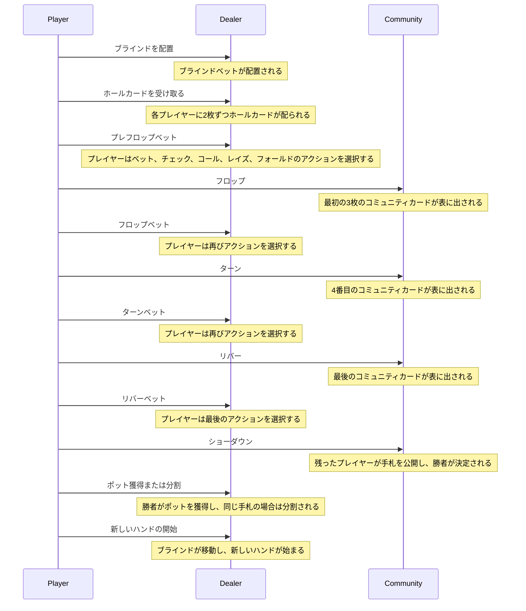

```mermaid
sequenceDiagram
    participant Player
    participant Dealer
    participant Community

    Player->>Dealer: ブラインドを配置
    Note over Dealer: ブラインドベットが配置される

    Player->>Dealer: ホールカードを受け取る
    Note over Dealer: 各プレイヤーに2枚ずつホールカードが配られる

    Player->>Dealer: プレフロップベット
    Note over Dealer: プレイヤーはベット、チェック、コール、レイズ、フォールドのアクションを選択する

    Player->>Community: フロップ
    Note over Community: 最初の3枚のコミュニティカードが表に出される

    Player->>Dealer: フロップベット
    Note over Dealer: プレイヤーは再びアクションを選択する

    Player->>Community: ターン
    Note over Community: 4番目のコミュニティカードが表に出される

    Player->>Dealer: ターンベット
    Note over Dealer: プレイヤーは再びアクションを選択する

    Player->>Community: リバー
    Note over Community: 最後のコミュニティカードが表に出される

    Player->>Dealer: リバーベット
    Note over Dealer: プレイヤーは最後のアクションを選択する

    Player->>Community: ショーダウン
    Note over Community: 残ったプレイヤーが手札を公開し、勝者が決定される

    Player->>Dealer: ポット獲得または分割
    Note over Dealer: 勝者がポットを獲得し、同じ手札の場合は分割される

    Player->>Dealer: 新しいハンドの開始
    Note over Dealer: ブラインドが移動し、新しいハンドが始まる
```