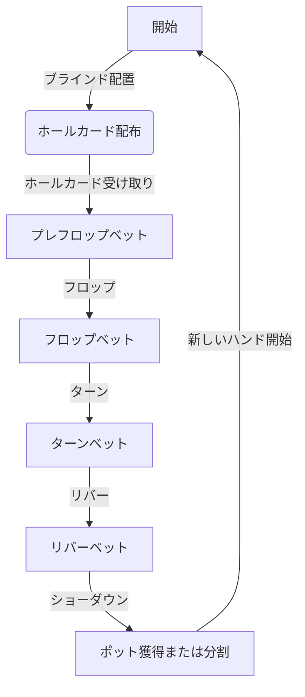

```mermaid
graph TD
    A[開始] -->|ブラインド配置| B(ホールカード配布)
    B -->|ホールカード受け取り| C[プレフロップベット]
    C -->|フロップ| D[フロップベット]
    D -->|ターン| E[ターンベット]
    E -->|リバー| F[リバーベット]
    F -->|ショーダウン| G[ポット獲得または分割]
    G -->|新しいハンド開始| A
```